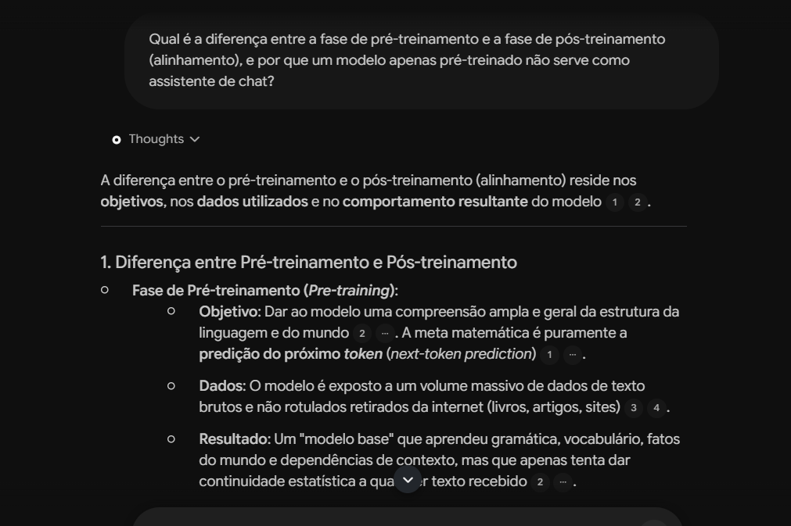
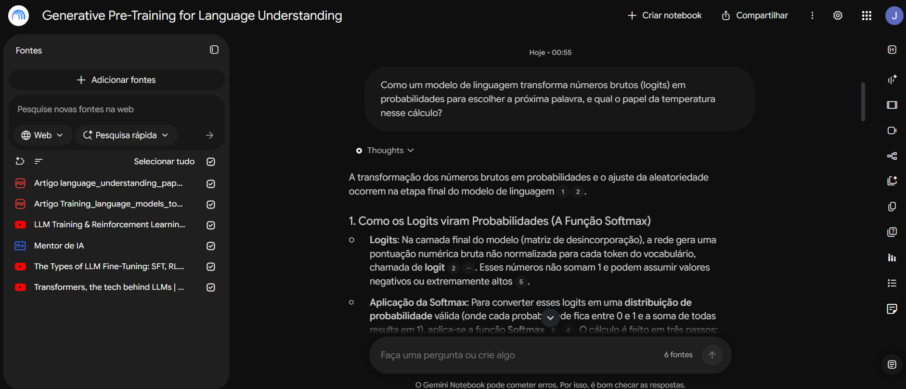
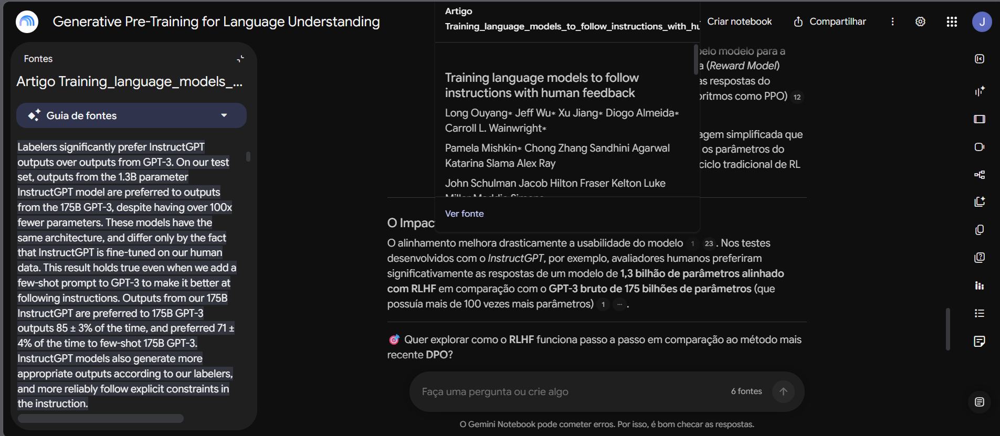

# segundo-cerebro-matematica-dos-llms

# 🧠 Segundo Cérebro: A Matemática e o Treinamento Real de LLMs

> **Desafio DIO:** Construindo um Segundo Cérebro com Gemini Notebook (NotebookLM)  
> **Tema:** Probabilidade de Saída e Pipeline Real de Treinamento de Modelos de Linguagem  
> **Status:** Concluído e Documentado ✅

---

## 🎯 Tema e Objetivo

> *"Explicar os fundamentos matemáticos e probabilísticos da geração de respostas em LLMs e desmistificar como esses modelos são realmente treinados, da distribuição de tokens ao pós-treinamento com alinhamento."*

---

## 🔗 Link do Gemini Notebook

* 📂 **Caderno Interativo:** [Acesse o Gemini Notebook deste projeto aqui](https://notebook.google.com/notebook/e639cbb5-1891-453a-85d9-fe79678df6f8?authuser=1)
*(Configurado como visualização pública com todas as 6 fontes indexadas e chat disponível).*

---

## 📚 Fontes Curadas e Critérios de Confiabilidade

Para assegurar respostas matematicamente precisas e fundamentadas no estado da arte da engenharia de IA, foram selecionadas **6 fontes de alta autoridade científica e prática**, combinando artigos seminais em PDF e conteúdos audiovisuais técnicos:

| # | Fonte | Formato | Autor / Origem | Por que confio nesta fonte? (Justificativa) |
|---|---|---|---|---|
| **1** | *Training language models to follow instructions with human feedback* | Artigo Científico (PDF) | Long Ouyang et al. (OpenAI / arXiv, 2022) | Paper oficial seminal que deu origem ao InstructGPT/ChatGPT, estabelecendo o padrão da indústria para alinhamento via RLHF. |
| **2** | *Improving Language Understanding by Generative Pre-Training* | Artigo Científico (PDF) | Alec Radford et al. (OpenAI, 2018) | Artigo original do GPT-1 que formalizou matematicamente a modelagem autoregressiva e a função de perda logarítmica de próximo token. |
| **3** | *Visualizing Attention and Transformers* | Vídeo (YouTube) | Canal *3Blue1Brown* | Maior autoridade global em visualização matemática didática; ilustra o cálculo de vetores, matrizes de atenção e a conversão de logits em probabilidades. |
| **4** | *Treinamento de LLMs e Aprendizado por Reforço \| SFT + RLHF \| PPO vs GRPO* | Vídeo (YouTube) | Canal *Martin is a dad* (com Eng. do Google) | Visão direta da indústria em Big Tech, detalhando clusters de GPUs, limitações do PPO e a evolução para algoritmos modernos de RL como GRPO. |
| **5** | *Os Tipos de Fine-Tuning de LLMs: SFT, RLHF, DPO e LoRA Explicados* | Vídeo (YouTube) | Canal *SH AI Academy* | Síntese técnica recente e de alto nível sobre as alternativas eficientes de ajuste fino (DPO e adaptação por matrizes de baixo rank com LoRA). |
| **6** | *Attention Is All You Need* | Artigo Científico (PDF) | Vaswani et al. (Google Brain / Research, 2017) | Artigo fundador da arquitetura Transformer, que introduziu a equação original de *Scaled Dot-Product Attention* e o uso da função Softmax. |

### Critérios de Curadoria:
1. **Autoridade:** Apenas pesquisadores que publicaram os modelos seminais ou engenheiros que treinam modelos em ambiente de produção.
2. **Mecanismo Real vs. Metáforas:** Foco estrito em equações, funções de perda, vetores e matrizes, sem especulações superficiais sobre "consciência da IA".
3. **Equilíbrio Multimodal e Temporal:** Equilíbrio entre a base teórica clássica (2017–2022) e os avanços modernos (DPO, LoRA e GRPO em 2024–2026).

---

## 🧭 Diretriz de Comportamento (Persona do Notebook)

A seguinte diretriz foi atribuída ao notebook para calibrar o tom das respostas e o rigor metodológico:

```text
Você é um especialista em matemática estatística,engenharia de aprendizado de máquina e meu mentor técnico. Me fale sobre como os modelos de linguagem realmente funcionam. Responda às minhas perguntas com clareza conceitual,o passo a passo da matemática de probabilidade (logits, softmax, amostragem) e o pipeline real de treinamento (pré-treino, SFT, RLHF, DPO, GRPO), citando as fontes fornecidas como referência"

## 💬 Conversas com as Fontes e Evidências de Citação (*Grounding*)
Abaixo estão as consultas realizadas ao notebook demonstrando a fidelidade estrita às fontes:
### 🔹 Pergunta 1: Pré-Treinamento vs. Pós-Treinamento (Alinhamento)
* **Pergunta feita:** *"Qual é a diferença entre a fase de pré-treinamento e a fase de pós-treinamento (alinhamento), e por que um modelo apenas pré-treinado não serve como assistente de chat?"*
* **Síntese da Resposta:** A diferença reside nos objetivos, nos dados e no comportamento. No **Pré-treinamento**, o modelo consome bilhões de textos não rotulados para aprender a predição do próximo token (*next-token prediction*), gerando um modelo base que apenas continua texto estatisticamente. No **Pós-treinamento**, o modelo é refinado para seguir instruções e agir como assistente seguro e colaborativo.
* **Fontes Citadas:** Trechos [1], [2], [3] e [4] dos artigos e vídeos técnicos.

#### 📸 Evidência da Consulta:

---
### 🔹 Pergunta 2: A Matemática dos Logits, Softmax e Temperatura
* **Pergunta feita:** *"Como um modelo de linguagem transforma números brutos (logits) em probabilidades para escolher a próxima palavra, e qual o papel da temperatura nesse cálculo?"*
* **Síntese da Resposta:** Na camada final, a rede gera pontuações numéricas brutas não normalizadas chamadas **logits** para cada token do vocabulário [2][5]. Para transformar esses números em uma distribuição real (soma igual a 1 e valores entre 0 e 1), aplica-se a função **Softmax** [5][6]. A temperatura atua ajustando a aleatoriedade e suavizando/acentuando a curva de probabilidade.
* **Fontes Citadas:** Artigos seminais e vídeos explicativos (*GPT-1*, *Transformers* e *SH AI Academy*).
#### 📸 Evidência da Consulta (com painel de fontes ativo):

---
### 🔹 Pergunta 3: O Impacto Prático do Alinhamento (Auditoria de Citação)
* **Pergunta feita:** *"O Impacto Prático do Alinhamento"*
* **Síntese da Resposta:** O alinhamento com RLHF melhora drasticamente a usabilidade do modelo [1][23]. Nos testes empíricos do *InstructGPT*, avaliadores humanos preferiram significativamente as respostas de um modelo de apenas **1,3 bilhão de parâmetros alinhado** em comparação ao **GPT-3 bruto de 175 bilhões de parâmetros** (mesmo este tendo mais de 100 vezes mais parâmetros) [1].
* **Comprovação de Grounding:** A janela lateral do notebook recuperou o trecho original exato do artigo em inglês: *"Labelers significantly prefer InstructGPT outputs over outputs from GPT-3. On our test set, outputs from the 1.3B parameter InstructGPT model are preferred to outputs from the 175B GPT-3..."*.
#### 📸 Evidência da Citação Direta no Paper Original:


📦 Materiais Gerados no Estúdio (Studio)

Os seguintes artefatos foram gerados pelo Gemini Notebook a partir da síntese das fontes e estão versionados neste repositório:

🧠 Mapa Mental da Arquitetura e Treinamento de LLMs: Visualização estruturada da esteira de dados, desde a entrada de tokens até o pós-treino com alinhamento.
📊 Slide "Arquitetura e Treinamento de LLMs" (.pdf): Apresentação didática gerada para estudo, revisão e compartilhamento.
🎙️ Podcast Completo: Imersão Técnica em Probabilidade e Treinamento de LLMs (.m4a): Debate aprofundado de 25 minutos entre dois apresentadores de IA discutindo os contrastes entre a modelagem probabilística e a aplicação de RL moderno. (Também disponível para reprodução interativa via link público do caderno).

📂 Estrutura do Repositório
segundo-cerebro-matematica-dos-llms/
│
├── README.md                              # Documentação completa do projeto
├── LICENSE                                # Licença MIT
├── .gitignore                             # Regras de exclusão do Git
│
├── assets/                                # Prints comprobatórios do chat e citações
│   ├── evidencia-citacao-1.png
│   ├── evidencia-citacao-2.png
│   └── evidencia-citacao-3.png
│
└── materiais/                             # Artefatos exportados do Gemini Notebook
    ├── NotebookLM Mind Map.png            # Mapa mental visual
    ├── Arquitetura_e_Treinamento_de_LLMs.pdf  # Slides em PDF
    └── resumo-podcast.m4a                 # Episódio de podcast (25 min)

💡 Aprendizados e Conclusões

A construção deste segundo cérebro permitiu consolidar que a "inteligência" de um modelo de linguagem não decorre de raciocínio consciente, mas de uma orquestração matemática rigorosa:

Probabilidade em Escala: A previsão de próximo token via Softmax e função de perda em trilhões de tokens constrói uma representação estatística densa do mundo.
O Papel Crítico do Alinhamento: O pós-treinamento com dados de preferência humana (RLHF/DPO/GRPO) é o verdadeiro responsável por transformar uma base probabilística bruta em um assistente colaborativo, seguro e útil.